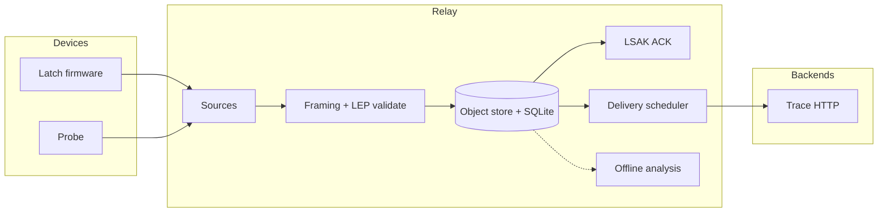

# Architecture

Relay sits between devices (Latch/Probe) and Trace. Collection is decoupled from
analysis and delivery so a slow symbolizer or a down backend never delays ACK.

## Paths

| Path | Role |
|------|------|
| Ingest | Accept frames, validate, write spool, ACK |
| Delivery | Claim pending rows, POST to Trace, retry |
| Analysis | CLI / offline only — never on the ACK critical path |

## Sources

Serial, TCP/TLS, UDP, HTTP, directory watch, MQTT, and external adapters
(subprocess with length-prefixed frames). Framing is configurable per source
(`latch-stream`, `cobs`, or `raw`).
