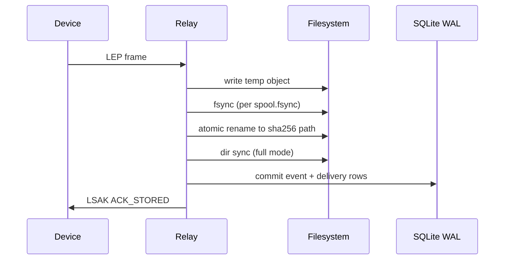

# Durability

An event is acknowledged only after the full write path below finishes. If the
process dies mid-way, the device may retransmit; content-addressed IDs make that
safe.

## Steps

1. Write a temporary file in the target directory.
2. Sync the file according to `spool.fsync` (`full`, `balanced`, or `none`).
3. Rename it to the SHA-256 object path.
4. In `full` mode, sync the parent directory (best-effort on Windows).
5. Commit metadata to SQLite WAL.
6. Create destination delivery records.

## Delivery

Delivery is at-least-once. Trace may accept an event before the response is lost;
Relay retries with the same event ID and `Idempotency-Key`.
