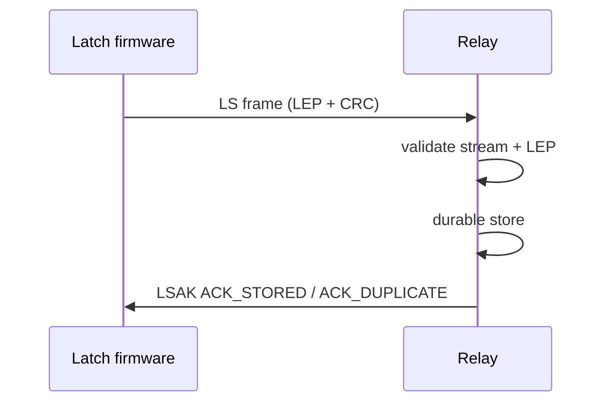

# Latch integration

Relay accepts the stream from Latch's `ls_stream_transport_send` as defined in
`latch/include/laststate/stream_transport.h`:

```text
"LS" | version 1 | flags 0 | LEP size (u32 LE) | LEP envelope | IEEE CRC32 of envelope
```

Stream CRC is checked first, then the LEP envelope. The device is only ACKed after
the object is fsynced, renamed, and recorded in SQLite.



## LSAK

Latch exposes `wait_ack` but does not mandate a response format. Relay's optional
`lsak-v1` profile is:

```text
"LSAK" | version 1 | status | reserved u16 | event_id u32 LE
```

| Status | Meaning |
|--------|---------|
| 1 | ACK_STORED |
| 2 | ACK_DUPLICATE |
| 3 | NACK_CORRUPT |
| 4 | NACK_UNSUPPORTED |
| 5 | NACK_BUSY |
| 6 | NACK_TOO_LARGE |

Firmware should read 12 bytes, check the magic, match `event_id`, and treat only
`ACK_STORED` / `ACK_DUPLICATE` as success. That callback lives in the board
UART/USB glue — Latch core does not ship a generic control RX.
